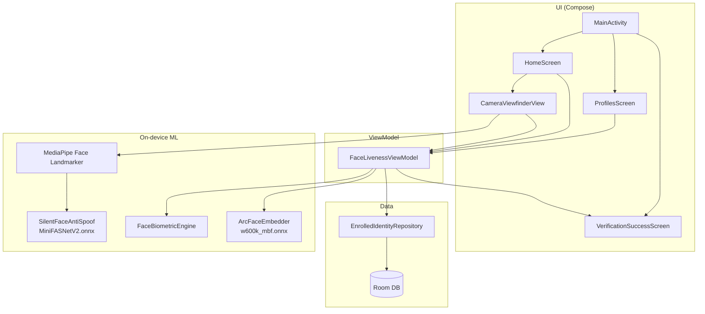
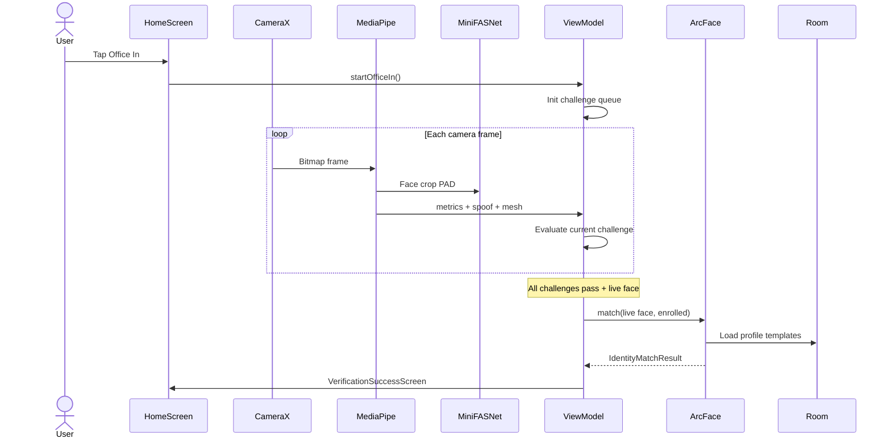
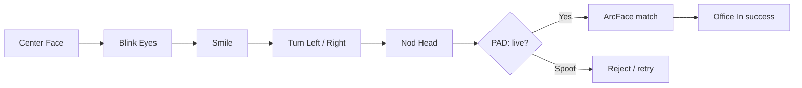

# Face Liveness AI

[](LICENSE)

Android app for **office attendance** with on-device face liveness, anti-spoofing, and identity matching. Tap **Office In**, complete active challenges in front of the camera, and match against enrolled employee profiles stored locally.

| | |
|---|---|
| **Platform** | Android 7.0+ (API 24), target SDK 36 |
| **UI** | Jetpack Compose + Material 3 |
| **Camera** | CameraX |
| **Liveness** | MediaPipe Face Landmarker (mesh + blendshapes) |
| **Anti-spoof** | MiniFASNetV2 ONNX (Silent-Face) |
| **Identity** | ArcFace ONNX (`w600k_mbf`) + cosine match |
| **Storage** | Room (enrolled profiles) |

---

## Features

- **Office In flow** — guided active liveness (center face, blink, smile, turn, nod)
- **Passive anti-spoof** — MiniFASNetV2 print / replay detection on live frames
- **Identity match** — ArcFace embeddings compared to enrolled templates
- **Profiles** — enroll / edit / delete people with photo and contact details
- **Offline-first** — models and matching run on-device (no cloud required for core flow)

---

## Architecture



### Module layout

```
app/src/main/java/com/example/
├── MainActivity.kt              # Entry, tabs, permission
├── ui/                          # Compose screens + camera overlay
├── viewmodel/                   # FaceLivenessViewModel + UI state
├── mediapipe/                   # Face Landmarker helper
├── ml/                          # ArcFace, MiniFASNet, biometrics
├── data/                        # Repository + Room
└── model/                       # Metrics, challenges, profiles
```

---

## Office In flow



### Challenge pipeline



---

## Models (assets)

Bundled under `app/src/main/assets/`:

| Asset | Role | Approx. size |
|-------|------|--------------|
| `face_landmarker.task` | MediaPipe Face Landmarker (478 landmarks, blendshapes) | ~3.6 MB |
| `MiniFASNetV2.onnx` | Silent-Face anti-spoof (real vs print/replay) | ~1.7 MB |
| `w600k_mbf.onnx` | ArcFace mobile backbone (112×112 → 512-D) | ~13 MB |

ONNX runs via **ONNX Runtime Android**. MediaPipe uses the CPU delegate for broad device support.

---

## Screens

| Tab / screen | Purpose |
|--------------|---------|
| **Home** | Idle attendance card → Office In camera + challenge UI |
| **Profile** | List / add / edit / delete enrolled identities |
| **Verification success** | Captured frame, timestamp, match score |

---

## Tech stack

- Kotlin **2.0.21**, AGP **8.8.0**, Compose BOM **2024.10.01**
- CameraX, ML Kit Face Detection, MediaPipe Tasks Vision, ONNX Runtime
- Room + KSP, Coroutines / Flow
- Firebase App Check (optional; `google-services.json` can be omitted — warn strategy)

Versions are managed in [`gradle/libs.versions.toml`](gradle/libs.versions.toml).

---

## Package references

- **MediaPipe Face Landmarker** — [`com.google.mediapipe:tasks-vision`](https://developers.google.com/mediapipe/solutions/vision/face_landmarker)
- **ML Kit Face Detection** — [`com.google.mlkit:face-detection`](https://developers.google.com/ml-kit/vision/face-detection)
- **MiniFASNetV2 + ArcFace ONNX** — [`com.microsoft.onnxruntime:onnxruntime-android`](https://onnxruntime.ai/docs/install/#install-on-android)  
  - MiniFASNetV2 (Silent-Face): [minivision-ai/Silent-Face-Anti-Spoofing](https://github.com/minivision-ai/Silent-Face-Anti-Spoofing)  
  - ArcFace (`w600k_mbf.onnx`): on-device identity embedding via ONNX Runtime

---


## Requirements

- JDK 17+ (project uses JBR 21 in Android Studio)
- Android SDK with `compileSdk` / `targetSdk` 36
- Device or emulator with camera (min API 24)
- USB debugging enabled for physical devices

---

## Build & run

```bash
# From project root
export JAVA_HOME=/path/to/jdk   # e.g. ~/.jdks/jbr-21.0.11
./gradlew :app:assembleDebug

# Install on a connected device
adb install -r app/build/outputs/apk/debug/app-debug.apk
adb shell am start -n com.aistudio.faceliveness.qxrvtn/com.example.MainActivity
```

Or open the project in **Android Studio** and run the `app` configuration.

Debug signing uses `debug.keystore` at the repo root (generated automatically if missing/empty).

---

## Permissions

| Permission | Why |
|------------|-----|
| `CAMERA` | Live preview and frame analysis |
| `INTERNET` | Optional Firebase / network (core path works offline) |

---

## Notes

- First launch requests camera permission; without it the app can fall back to a **simulation** path for UI testing.
- Identity matching quality depends on enrolled photo quality and lighting during Office In.
- On low-RAM / Go editions, prefer a mid-tier or newer device for smoother MediaPipe + ORT performance.

---

## License

Copyright 2026 Debasis Koley.  
This project’s **source code** is licensed under the [Apache License 2.0](LICENSE).  
See also [`NOTICE`](NOTICE) for third-party attribution.

### Commercial use

**Yes — for this project’s Apache-2.0 code**, you may use, modify, and distribute it commercially (including in products), provided you:

1. Include a copy of the [Apache License 2.0](LICENSE)
2. Retain copyright / attribution notices (and [`NOTICE`](NOTICE) where applicable)
3. Mark modified files as changed
4. Comply with each **third-party** dependency and model license below

| Component | License / terms | Commercial use? |
|-----------|-----------------|-----------------|
| **This app** (Kotlin / Compose source) | [Apache License 2.0](LICENSE) | **Yes**, under Apache-2.0 |
| **MediaPipe** (`tasks-vision`, Face Landmarker) | [Apache License 2.0](https://github.com/google-ai-edge/mediapipe/blob/master/LICENSE) | **Yes**, with notice retention |
| **ML Kit Face Detection** | [ML Kit Terms of Service](https://developers.google.com/ml-kit/terms) | **Yes** for on-device SDK use; do not reverse-engineer models |
| **ONNX Runtime Android** | [MIT](https://github.com/microsoft/onnxruntime/blob/main/LICENSE) | **Yes** |
| **MiniFASNetV2** (Silent-Face open-source) | [Apache License 2.0](https://github.com/minivision-ai/Silent-Face-Anti-Spoofing) | **Yes** for the published open-source models, with attribution |
| **ArcFace ONNX** (`w600k_mbf.onnx`) | Upstream model / weight license | **Verify separately** — Apache-2.0 on this repo does **not** relicense those weights |

Also follow privacy / biometric consent rules in your jurisdiction. This section is **not legal advice**.

